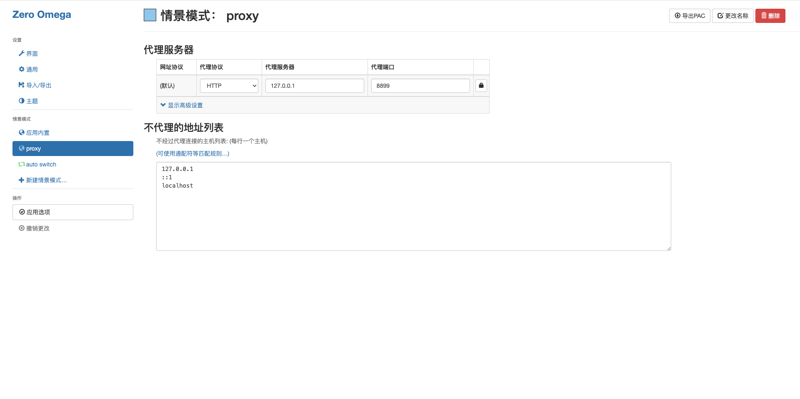
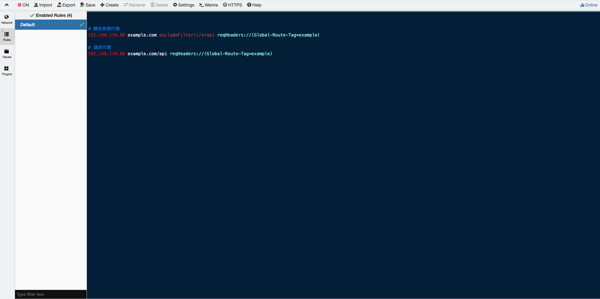

# Zero Omega、whistle 和本地 Vue 项目 proxy 的代理链路详解

## 一、代理链路顺序

1. **浏览器发起请求**  
2. **本地 Vue 项目的 devServer.proxy 先处理**  
	 - 只对本地开发服务器（如 http://localhost:5173）发起的请求生效。
	 - 例如：你访问 `/api/user`，devServer.proxy 会把它转发到目标后端（如 http://backend.local/api/user）。
3. **Zero Omega**  
	 - Zero Omega相当于是把大量的请求都导入到8899端口。让whistle进行代理，一般配置如下：
	 

4. **whistle 可以再做一次转发、修改、抓包等操作**  
	简单示例如下：
	

